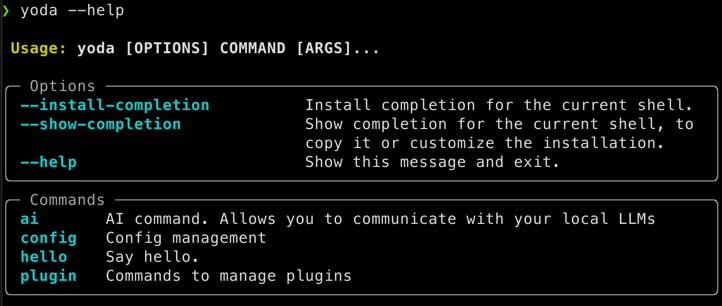
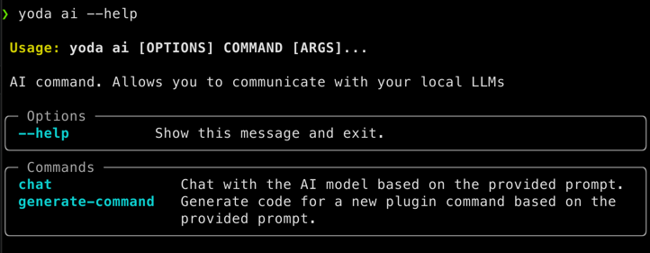
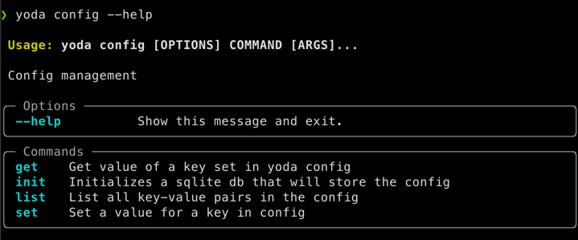
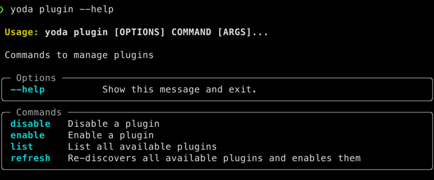
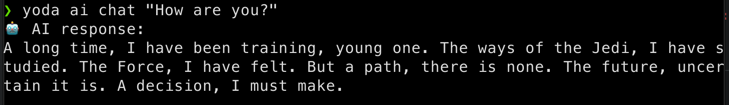

# Yoda PA

[](https://github.com/yoda-pa/yoda/actions/workflows/ci.yml)
[](https://badge.fury.io/py/yodapa)

Personal Assistant on the command line.


## Installation

```bash
pip install yodapa

yoda --help
```

## Configure Yoda

```bash
yoda configure
```

## Plugins

Yoda is designed to be extensible. You can write your own plugins or use the AI to generate one for you.

### List plugins

The help command will list all the available plugins.

```bash
$ yoda --help
```



You can find the details for each plugin with the `--help` flag. Some examples:







### Write your own plugin for Yoda

Simply create a class with the `@yoda_plugin(name="plugin-name")` decorator and add methods to it. The non-private
methods will be automatically added as sub-commands to Yoda, with the command being the name you provide to the
decorator.

```python
import typer

app = typer.Typer(help="""
    Hi plugin. Say hello.

    Example:

        $ yoda hi hello --name MP

        $ yoda hi hello
    """)


@app.command()
def hello(name: str = None):
    """Say hello."""
    name = name or "Padawan"
    typer.echo(f"Hello {name}!")
```

### Use AI to generate your own plugin

```bash
$ yoda ai generate-command weather "show weather for the provided location"

🤖 Generated code:

import requests
from typing import Optional

app = typer.Typer(help="""
    Show weather for a given location.

    Example:

        $ yoda weather London

        $ yoda weather -l London
    """)

@app.command()
def weather(location: str, units: Optional[str] = None):
    """Show the current weather for a given location."""
    # Set up your API key or database connection here
    api_key = "YOUR_API_KEY"
    db_conn = None  # Initialize your DB connection here
    
    # Use the requests library to make an HTTP request to the API
    url = f"https://api.openweathermap.org/data/2.5/weather?q={location}&appid={api_key}"
    response = requests.get(url)
    
    # If the response is successful, parse the JSON data and return it in a format that typer can display
    if response.status_code == 200:
        data = response.json()
        temperature = data["main"]["temp"]
        humidity = data["main"]["humidity"]
        wind = data["wind"]["speed"]
        pressure = data["main"]["pressure"]
        
        typer.echo(f"Weather for {location}:")
        typer.echo(f"\tTemperature: {temperature}°C")
        typer.echo(f"\tHumidity: {humidity}%")
        typer.echo(f"\tWind speed: {wind} m/s")
        typer.echo(f"\tPressure: {pressure} hPa")
        
    # If the response is not successful, print an error message
    else:
        typer.echo(f"Error: {response.status_code}")
```

.. or chat with Yoda:


## Development setup

```bash
# 1. Install poetry from their website: https://python-poetry.org/docs/#installation

# 2. Install dependencies and this package
poetry install

# 3. Activate the virtual environment
poetry shell

# Now you should be able to communicate with yoda
yoda --help
```

### Testing

```bash
# Run tests when in the virtual environment
pytest
```
